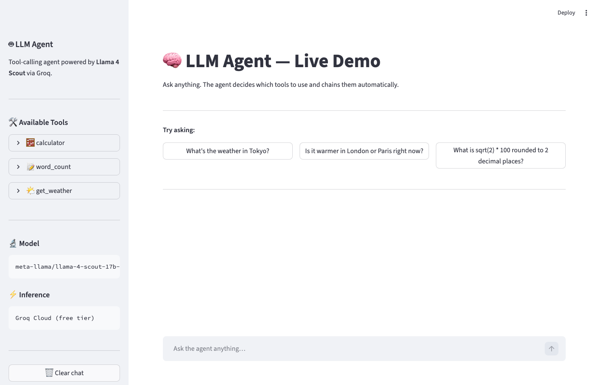

# LLM-from-scratch

A hands-on learning repo for building, fine-tuning, and deploying large language models and AI agents from the ground up. Everything here is built step by step — no black boxes.

---

## Live Demo



> **Run it locally:**
> ```bash
> conda activate llm-lab
> streamlit run app.py
> ```
> Requires a `GROQ_API_KEY` in your `.env` file.

---

## Goal

The goal is to go from zero to being able to:
- Fine-tune open-source LLMs on custom datasets
- Build tool-calling agents that interact with real APIs and data
- Deploy models and agents in production

Both tracks are developed in parallel — agents on a local machine, model training on an HPC cluster with GPU nodes.

---

## What We Have So Far

### Agents — `agents/`

A tool-calling agent built from scratch using the Groq API and Llama 4 Scout. No frameworks — just raw API calls so you understand exactly what's happening under the hood.

The agent can:
- Do math using a calculator tool
- Count words in text
- Fetch live weather for any city in the world using the Open-Meteo API

The key insight: the model never runs any of this code itself. It reads tool descriptions, decides which tool to call and with what inputs, and your Python code does the actual work. The model is the brain. Your code is the hands.

### Training — `training/`

Inference pipeline running on a GPU cluster. Loads `Qwen2.5-0.5B-Instruct` (a 494M parameter model by Alibaba) from HuggingFace and runs it on a GPU — proving the full stack works end to end before moving to fine-tuning.

---

## Repo Structure

```
LLM-from-scratch/
├── agents/          # Tool-calling agents
├── training/        # Inference and fine-tuning scripts
│   └── slurm/       # HPC job submission scripts
├── data/            # Datasets and preprocessing
├── notebooks/       # Exploration and experiments
├── configs/         # Model and training configs
├── scripts/         # Utility and setup scripts
└── requirements.txt         # Mac/dev dependencies
    requirements_hpc.txt     # HPC dependencies
```

---

## Model Families

Open-source LLMs come from several major families. The ones used or planned in this repo:

| Family | Made by | Known for |
|---|---|---|
| **Llama** | Meta | Most popular open-source family, powers most of the OSS ecosystem |
| **Qwen** | Alibaba | Strong at coding and math, what we use for training |
| **Gemma** | Google | Lightweight, runs on smaller hardware |
| **Mistral** | Mistral AI | Efficient, punches above its weight |

The size of a model is measured in parameters — the numbers learned during training:

```
0.5B   →  tiny, fast, good for learning
7–8B   →  sweet spot for fine-tuning on a single GPU
70B    →  high quality, needs multiple GPUs
```

---

## Tech Stack

**Language & Environment**


**LLM APIs & SDKs**


**Agent Frameworks**


**Vector Store / RAG**


**Model Training & Fine-tuning**


**Apple Silicon**


**Infrastructure**


---

## Setup

**Mac (agent development):**
```bash
conda activate llm-lab
pip install -r requirements.txt
```

**HPC (model training):**
```bash
module load anaconda
conda activate llm-lab
```

Create a `.env` file in the repo root for API keys — never commit this file:
```
GROQ_API_KEY="gsk_..."
HF_TOKEN="hf_..."
```